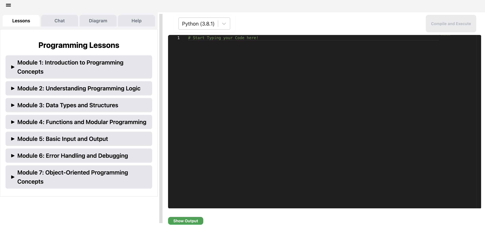

# Pair Academy

I found pair programming an incredibly value experience when I was learning to code. I wanted to create a platform that would replicate that experience with AI. To allow beginners to get personalized, instantaneous, and relevant feedback on their journey in learning how to code. That is the story behind Pair Academy.

## Demo

To be added.

## Backlog

- [ ] UX Upgrades
- [ ] Add More Lessons
- [ ] Enable in editor edits from tutor